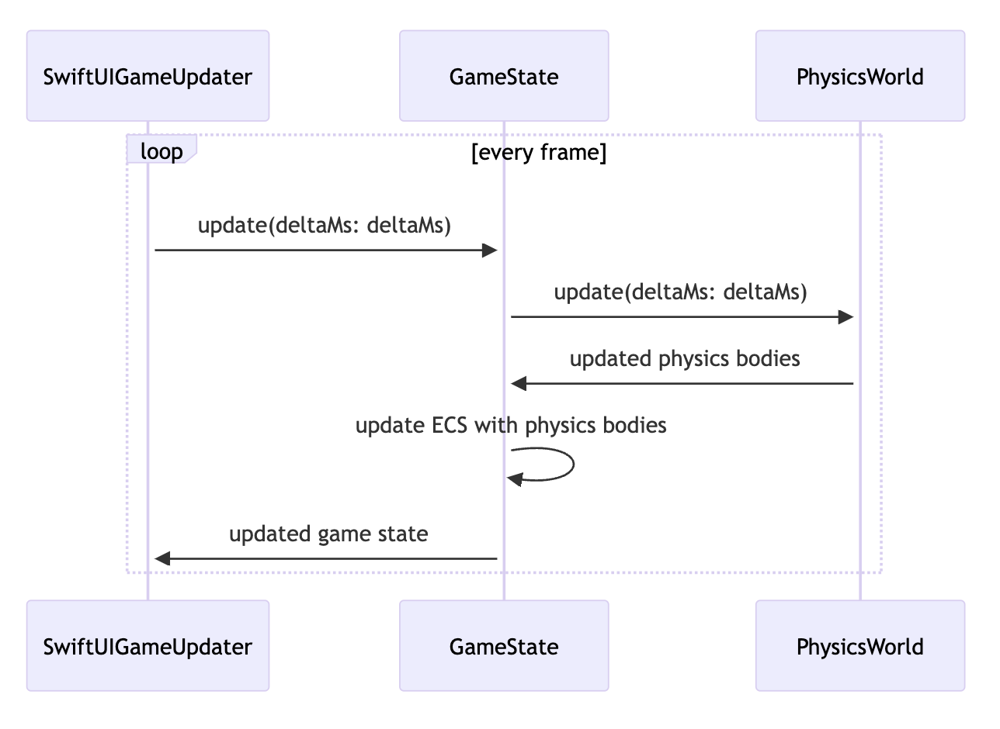

# Dev Guide

## Structure

- `JPeggle`:
  - `LevelDesigner/` - models related to game state
  - `LevelSelection/` - views related to level selection
  - `MainMenu/` - views related to main menu
  - `Persistence/` - storing levels
  - `PhysicsEngine/` - physics calculations
  - `ECS/` - an implementation of entity-component-system
  - `Game/` - game logic

## Entity-component-system

The `ECS/` folder implements a version of entity-component-system.

It differs from the traditional ECS where Entities are just IDs.

In this implementation, Entity classes store a list of components. Components are structs which store data. Systems are structs which operate on entities with specific components.

### Entity

An `Entity` contains a list of `Component`s. It is a class, and is `Identifiable`.

### Entities
`Entities` is a struct containing entities, mapping `Entity.ID` to `Entity`. It acts as the "world" for entities, and it is used to query entities.

Here is an example usage of it.

```swift
let entities = Entities()
let entity = Entity()

entity.assign(VehicleComponent())
entities.add(entity)

let vehicleArchetype = createArchetype(VehicleComponent.self)
let results = entities.ofArchetype(vehicleArchetype)

```

### Component

A component comforms to `Component`. It is a struct, and is `Identifiable`.

`Component` has an `id` field which needs to be set by the conforming struct. This allows it to be `Saveable`.

### Archetype

An archetype represents a set of components. It is used to query entities with specific components.

The helper function `createArchetype()` is an overloaded function which creates an archetype from a list of components.

```swift
let archetype1 = createArchetype(Component1.self)
let archetype2 = createArchetype(Component1.self, Component2.self)
```

### System

A system is a generic struct which accepts an `update` callback. It operates on entities with specific components, as defined by the `archetype` passed into it.

```swift
struct System<A: Archetype> {
    init(archetype: A, update: @escaping ([QueryResult<A.ComponentTuple>], inout Entities) -> Void) {
        self.archetype = archetype
        self.update = update
    }

    let archetype: A
    let update: ([QueryResult<A.ComponentTuple>], inout Entities) -> Void

    func updateWith(entities: inout Entities) {
        let results = entities.ofArchetype(archetype)
        update(results, &entities)
    }
}
```

It can be used like this:

```swift
let system = System(archetype: createArchetype(Component1.self)) { results, entities in
    for result in results {
        for entity in result.entities {
            // do something
        }
    }
}

system.updateWith(entities: &entities)
```

## Physics Engine

The `PhysicsEngine/` folder implements the physics engine.

A physics simulation can be run in a `PhysicsWorld` containing `PhysicsBody` objects.

`PhysicsWorld` exposes an `update(deltaMs: Double)` function, which updates the state of the world by `deltaMs` milliseconds.

### Collision detection

### Colliders

`PhysicsEngine/Collisions/` contains definitions for collision-related calculations.

A `Collider` represents a collision box for an object, relative to that object's origin. Currently there are two types of colliders: `CircleCollider` and `PolygonCollider`.

These two shapes should be sufficient to handle all collision detection for the game, as the game only has convex polygons and circles.


A `TransformedCollider` represents a collider placed at a specific position. They are used to resolve collsions between two physics bodies.

The code for actual collision calculation is in `PhysicsEngine/Collisions/CollisionResolver.swift`.
Here, there are definitions for circle-circle, circle-polygon, and polygon-polygon collision resolution.

> Note: Due to time constraints, ellipse collisions are not handled. In other words, circle colliders must be scaled equally on both axes. Collision behavior is undefined for circles which are scaled differently between x and y axes.

### Collision-detection algorithm

The collision detection algorithm uses Separating Axis Theorem (SAT) to detect collisions between two convex polygons.

Collisions are then resolved using the Minimum Translation Vector (MTV) method.

The velocities are updated using the impulse method.

### PhysicsBody

A `PhysicsBody` represents a physical object in the world. It has physical properties like `mass`, `velocity`, `restitution`, etc. It has a `Collider` object. `PhysicsBody` objects delegate the collision detection and resolution to their Collider objects.

It also has some flags that can be changed to modify collision behavior.
- `passthrough`: Only collisions are detected. Velocity and position are not affected for any collisions involving at least one passthrough body.
- `isKinematic`: Its own elocity and position is not affected by any collision.
- `resolveCollisions`: If true, adjusts the position of itself so as to un-overlap itself with non-passthrough collided bodies
- `collisionLayer`: defines the collision layer for the body. collision layers will be explained further in the next section.

### Collision layers, collision matrix

A PhysicsBody belongs to one collision layer. A PhysicsWorld defines which layers collide with which using a collision matrix.

A collision matrix keeps tracks of pairs of collision layers that can interact with one another.

This implementation of a collision matrix is similar to that found in the Unity game engine.

## Game Engine
The main game engine is built on top of the Physics Engine and the ECS library.

Its contents are in the `Game/` folder.

At its core, every entity in the game is represented as an ECS entity.

The entities in the game are:
- Cannonball
- Pegs
- Blocks
- Boundary walls (top, left, right, bottom)
- "Single" entities like Delta, AimPoint, which act as global variables

### Components

To make the implementation of the game possible, components such as the following were created:
- `CannonBall`
- `OutOfBounds`
- `Delta`
- `Peg`
- `PhysicsObject`
- `ShouldRemove`
- `Sprite`
- `Transform`
- etc

Each entity in the game is composed of several components. The components are thought of as units that define an entity's behavior. Systems act on entities by querying for entities with certain components, then updating the state accordingly by adding/modifying/removing entities accordingly.

### Systems

The game engine is built on top of the ECS library. It uses systems to update the game state.

The systems are:
- `EntityRemovalSystem`
- `OutOfBoundsClearingSystem`
- `PegClearingSystem`
- `PegLightingSystem`
- `StuckBallDetectionSystem`
- etc

You may find all the systems in the `Game/Systems` folder. These systems work together to define bits and pieces of the game behavior. A "single" game behavior is often composed of several smaller subsystems. An example is presented below.

#### Example system explanation:
One behaviour that is required for the game is for pegs to be lit when hit by a ball, then subsequently removed.

For this, there are several systems at play.

- PegTouchDetectionSystem queries for cannon balls and pegs, and updates the Peg component's isTouched to true.
- PegLightingSystem queries for pegs, and updates their Sprite component based on their Peg.isTouched value
- StuckBallDetectionSystem queries for cannonballs and their physics object components. When a cannonball is moving below a threshold speed, its slowMovingDuration is increased. After a certain duration of moving slowly, its cannonball component's Cannonball.isSlow value will be set to true
- PegClearingSystem queries for pegs and cannonballs. When all cannonballs in the game is deemed to be stationary (isSlow), all touched pegs will be cleared by adding the ShouldRemove component
- EntityRemovalSystem queries for all ShouldRemove entities, and removes them from the entity world.

From this example, we can see how modular the ECS implementation is. This definitely helps when more components and behaviours are added to the game.


### Game Logic Per Frame

The game state is encapsulated in the `GameState` struct, which exposes an `update(deltaMs: Double)` function.

This struct represents a snapshot of the game state at a particuar timestamp.


On each `GameState.update` call:

- Each system in the game is called sequentially, which updates the `entities`.

### Level Designer

The level designer creates levels that are directly consumed by the game.

Each Level is fundamentally a wrapper of an entity world with a name, width and height.

The rules of the level designer are implemented using PhysicsWorld as well. The pegs/blocks must be placed

Internally, the level designer runs a physics world with bodies for each placed peg/block. Collisions are detected using the physics world. Whenever a peg is transformed in the editor, a new physics world is created with the transformed peg. If collisions are detected, it is deemed to be an invalid placement.

The resultant entity world is then directly passed to the game runner via a Level struct.

### Running the game

The `GameView` view is responsible for rendering and running game. It contains a `SwiftUIGameUpdater` class which updates the game state every frame via `CADisplayLink`. The game state is updated by calling `gameState.update(deltaMs: Double)`.

The following diagram shows what happens every game loop




### Visuals and sounds

The game exposes adapter protocols to render Sprites and to play Sounds. These have SwiftUI implementations, but other implementations can be made to adapt to a different UI framework.